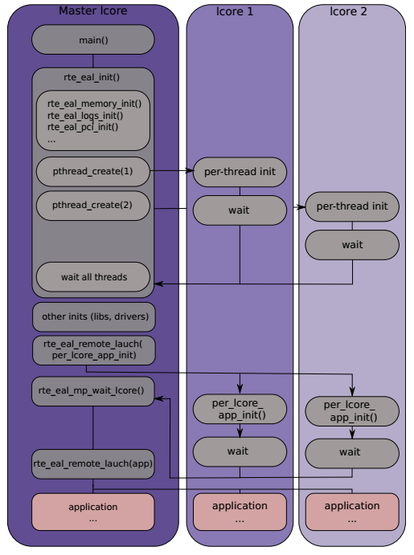

EAL
===

EAL(Environment Abstraction Layer)负责获得对低层资源，如硬件和\
内存空间的访问。它通过提供通用接口隐藏了应用程序和库环境的区别。\
初始化例程负责分配资源(内存空间，PCI设备，计时器，控制台等)。

EAL提供的服务有：

* DPDK的加载与启动
* CPU核绑定(Core Affinity/Assignment)
* 系统内存分配 
* PCI地址抽象
* 跟踪和调试
* 工具函数
* CPU特性识别
* 中断处理
* Alarm功能

Linux环境的EAL
--------------

在Linux用户空间，DPDK使用pthread库运行为一个用户程序。设备的PCI\
信息和地址空间使用/sys内核接口和uio相关内核模块来发现。内存通过\
mmap取得。

EAL通过在hugetlbfs中使用mmap()来分配物理内存，这些内存暴露给DPDK\
服务层，如mempool库。

EAL会初始化DPDK服务层，并通过pthread的setaffinity调用，把执行单元\
绑定到特定逻辑核心上，运行为一个用户线程。

EAL通过CPU Time-Stamp Counter(TSC)或HPET内核API(通过mmap调用)\
提供时间基准。

Linux环境中EAL的初始化过程如下图所示。

内存机制与初始化
----------------

见 :doc:`mem` 。

CPU信息取得与核绑定
-------------------

// TODO

线程/lcore的初始化与启动
------------------------

// TODO

多进程应用
----------

// TODO

其他注意事项
------------

// TODO

参考
----

.. [dpdk_guide_eal] `DPDP programmer's guide - EAL \
    <http://dpdk.org/doc/guides/prog_guide/env_abstraction_layer.html>`_

