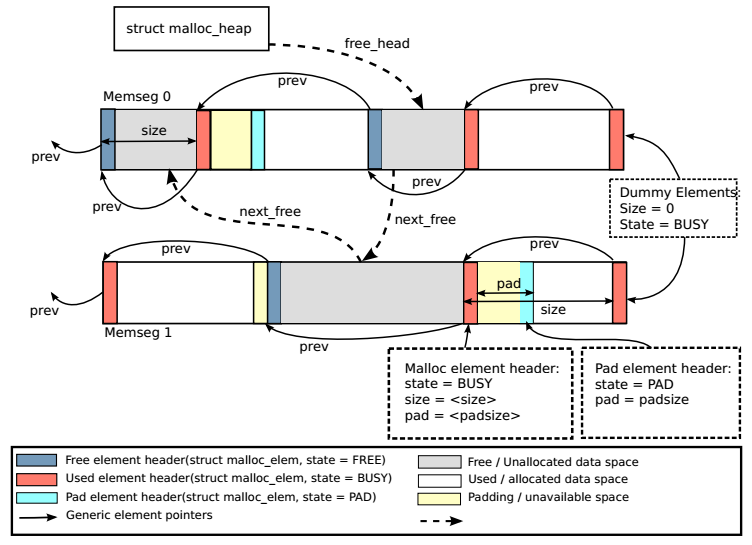

Malloc
======

概述
----

DPDK EAL提供了类似malloc的内存分配API，通过它可以分配任意大小的\
大页内存，同时有利于程序移植 (glibc malloc->rte_malloc)。

.. note::
    
    不要在数据平面代码中使用DPDK malloc，因为它在分配和释放时使\
    用了锁，影响效率；应该使用mempool获取内存。

数据结构
--------

主要有2个数据结构：

* struct malloc_heap - 用于在每个socket上跟踪空闲内存

    每个NUMA节点有一个malloc_heap结构，用于给NUMA节点上的线程\
    分配内存，然而，它无法保证此内存仅被当前NUMA节点所使用。

    .. code-block:: c

        struct malloc_heap {
            rte_spinlock_t lock;
            LIST_HEAD(, malloc_elem) free_head[RTE_HEAP_NUM_FREELISTS];
            unsigned alloc_count;
            size_t total_size;
        } __rte_cache_aligned;

    malloc_heap使用链表来维护空闲内存(free-list)，当多个线程都\
    需要访问此链表时，使用锁lock来进行同步；free_head指向free-list的首节点。

    另外可以看到，free-list并非只有一个，而是对RTE_HEAD_NUM_FREELISTS\
    (13)个。DPDK根据FREE内存块大小的不同，把它们挂到对应的链表上。

* struct malloc_elem - 用于分配和空闲内存跟踪的基本元素

    malloc_elem是不同内存块共用的通用首部结构体，它有3种用法：

    1) normal：做为空闲或已分配内存块的首部
    2) 在内存块内部作为填充首部(padding header)
    3) 做为memseg的结束标记

    .. code-block:: c

        struct malloc_elem {
            struct malloc_heap* heap;
            struct malloc_elem* volatile prev; // points to prev elem in memseg
            LIST_ENTRY(malloc_elem) free_list; // list of free elements in heap
            const struct rte_memseg* ms;
            volatile enum elem_state state;
            uint32_t pad;
            size_t size;
        #ifdef RTE_LIBRTE_MALLOC_DEBUG
            uint64_t header_cookie; // Cookie marking start of data
                                    // trailer cookie at start + size
        #endif
        } __rte_cache_aligned;

    其中，

    * heap 用来指回分配此项的malloc_heap，当normal内存块被回收时，\
      将它挂到heap上的空闲内存链表free-list
    * prev 指向memseg中紧挨着的前一个节点。当释放内存时，会通过它\
      来检查前一节点是否也可以被free，如果可以，那么当前节点和前一\
      节点会合并成一个大节点
    * next_free free_list是一个双向链表节点，它的next指针即next_free，\
      仅用于normal节点，用于把空闲内存块链起来形成free-list
    * state 节点状态，共有3个值：FREE，BUSY，和PAD。前两个用于表示\
      normal节点的内存状态，最后一个表示当前节点是pad数据的尾部\
      结构，用于内存对齐。当用于memseg的结束标记时，state置为BUSY，\
      确保在释放内存时不会越过memseg的边界来合并空闲节点
    * pad 填充数据的长度。对于normal节点，首部结束地址+pad就是\
      实际数据的起始地址。对于normal节点内部的pad节点，它的pad值\
      与外面normal节点的pad值相同
    * size 节点的大小，包括首部长度。对于memseg结束标记，size值\
      为0

Malloc相关数据结构的内部布局如下图所示:

.. _malloc_init:

malloc heap初始化
-----------------

在EAL初始化阶段，大页内存的memseg创建好之后，会调用\
rte_eal_malloc_heap_init()来初始化malloc heap。主要过程有：

* 在每个memseg首部添加state为FREE的节点
* 在每个memseg尾部添加state为BUSY的节点做为结束标记
* 将FREE节点挂到malloc heap的空闲内存链表free-list中

以下3行代码(librte_eal/common/malloc_heap.c: malloc_heap_add_memseg)\
分别对应这3个过程：

.. code-block:: c

    malloc_elem_init(start_elem, heap, ms, elem_size);
    malloc_elem_mkend(end_elem, start_elem);
    malloc_elem_free_list_insert(start_elem);

在把FREE节点挂到free-list的时候，如前所言，会根据其大小，挂入对应\
的free-list。

.. code-block:: c

    void malloc_elem_free_list_insert(struct malloc_elem *elem)
    {
        size_t idx;
        
        idx = malloc_elem_free_list_index(elem->size - MALLOC_ELEM_HEADER_LEN);
        elem->state = ELEM_FREE;
        LIST_INSERT_HEAD(&elem->heap->free_head[idx], elem, free_list);
    }

malloc_elem_free_list_index()用于求得链表的索引，从这个函数的代码\
可以看到DPDK是怎么根据内存块大小来划分13个free-list的。

.. code-block:: c

    size_t malloc_elem_free_list_index(size_t size)
    {
    #define MALLOC_MINSIZE_LOG2   8
    #define MALLOC_LOG2_INCREMENT 2

        size_t log2;
        size_t index;

        if (size <= (1UL << MALLOC_MINSIZE_LOG2))
            return 0;

        log2 = sizeof(size) * 8 - __builtin_clzl(size-1);

        index = (log2 - MALLOC_MINSIZE_LOG2 + MALLOC_LOG2_INCREMENT - 1) /
                MALLOC_LOG2_INCREMENT;

        return (index <= RTE_HEAP_NUM_FREELISTS-1?
                index: RTE_HEAP_NUM_FREELISTS-1);
    }

过程如下：

#. 如果size <= 2^8，则放入free_list[0]，否则到2
#. 计算log2(size)，取整数，比如2^7到2^8之间的数，含2^7，log2值都是7
#. 根据log2值，求对应的free_list索引。由于log2步长是2，所以对于n>8，\
   2^n和2^(n+1)会共用一个相同的下标
#. 若idx>(13-1)，则idx=12。大于等于2^31的全部会放入free_list[12]

注：__builtin_clzl()用于求unsigned long数第一个bit 1前面0的个数。

.. _malloc_heap_alloc:

内存分配
--------

核心函数malloc_heap_alloc(librte_eal/common/malloc_heap.c)。

首先从free_list中找到size对应的空闲节点，然后根据需要对此节点做\
一些处理，比如如果节点的内存大于所需内存，会分裂成两个节点。内存\
分配是有锁的(heap->lock)。

内存释放
--------

核心函数rte_free(librte_eal/common/rte_malloc.c)。

首先从内存地址得到malloc_elem节点首部的地址，然后检查此节点紧挨着\
的前后是否有FREE内存块，如果有的话则将它们合并成一个FREE内存节点，
添加到free_list。

参考
----

.. [dpdk_guide_malloc] `DPDK Malloc \
    <http://dpdk.org/doc/guides/prog_guide/env_abstraction_layer.html#malloc>`_

