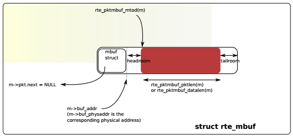
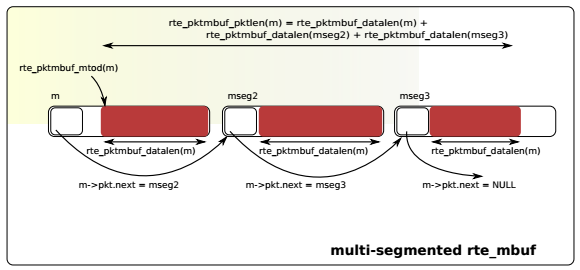
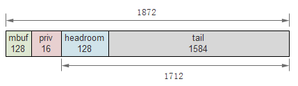
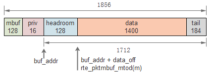

Mbuf
====

概述
----

DPDK mbuf实现了message buffer，可以存储报文数据或者控制信息等。\
mbuf存储在mempool中，以便在数据面提高访问性能。

原理
----

DPDK把元数据(metadata)和实际数据存储在一个mbuf中，并且使mbuf\
结构体尽量小，目前仅占用2个cache line，且最常访问的成员在第1个\
cache line中。

mbuf从前至后主要由mbuf首部(即rte_mbuf结构体)、head room、实际数据\
和tailroom构成。用户还可以在mbuf首部和head room之前加入一定长度的\
私有数据(private data)。head room的大小在DPDK编译配置文件(如\
common_linuxapp)中指定，如 ``CONFIG_RTE_PKTMBUF_HEADROOM=128`` 。\
mbuf的基本结构如下图所示：

一些指针、成员或函数结果的内容在下表中列出，mbuf指针简写为m：

=========================== =======================================
项                          内容
=========================== =======================================
m                           首部，即mbuf结构体
m->buf_addr                 headroom起始地址 
m->data_off                 data起始地址相对于buf_addr的偏移
m->buf_len                  mbuf和priv之后内存的长度，包含headroom
m->pkt_len                  整个mbuf链的data总长度
m->data_len                 实际data的长度
m->buf_addr+m->data_off     实际data的起始地址
rte_pktmbuf_mtod(m)         同上
rte_pktmbuf_data_len(m)     同m->data_len 
rte_pktmbuf_pkt_len         同m->pkt_len
rte_pktmbuf_data_room_size  同m->buf_len
rte_pktmbuf_headroom        headroom长度
rte_pktmbuf_tailroom        尾部剩余空间长度
=========================== =======================================

    注：data_off = MIN(headroom_len, buf_len)

上图中的buf只有一个数据段，在某些情况下，比如要处理巨帧(jumbo frame)\
时，可以把多个mbuf链接起来组成一个mbuf。下图是包含3个数据段的mbuf：

对于链式的mbuf，仅在第一个mbuf结构体中包含元数据信息。

以下代码分别创建了两个mbuf，给它们添加数据，最后将它们组合成链。\
在此过程中打印了上表中的一些数据，可以帮助理解各指针和长度的含义，\
其中省去了错误处理代码。

.. code-block:: c
    :linenos:
    :emphasize-lines: 8,9,16,22,25,32

    static int mbuf_demo(void)
    {
        int ret;
        struct rte_mempool* mpool;
        struct rte_mbuf *m, *m2;
        struct rte_pktmbuf_pool_private priv;

        priv.mbuf_data_room_size = 1600 + RTE_PKTMBUF_HEADROOM - 16;
        priv.mbuf_priv_size = 16;
        mpool = rte_mempool_create("test_pool",
                                   ITEM_COUNT,
                                   ITEM_SIZE,
                                   CACHE_SIZE,
                                   sizeof(struct rte_pktmbuf_pool_private),
                                   rte_pktmbuf_pool_init,
                                   &priv,
                                   rte_pktmbuf_init,
                                   NULL,
                                   0,
                                   MEMPOOL_F_SC_GET);
        m = rte_pktmbuf_alloc(mpool);
        mbuf_dump(m);   // (1)

        rte_pktmbuf_append(m, 1400);
        mbuf_dump(m);   // (2)

        m2 = rte_pktmbuf_alloc(mpool);
        rte_pktmbuf_append(m2, 500);
        mbuf_dump(m2);

        ret = rte_pktmbuf_chain(m, m2); 
        mbuf_dump(m);   // (3)
        
        return 0;
    }

首先注意第8，9，16行，为了演示用户私有数据，在创建mempool时传入了\
priv，这将在每个mbuf的首部后面添加16字节的私有数据，然后才是head room。\
内存池对象数目、第个对象的大小和cache大小分别是::

    #define ITEM_COUNT 1024
    #define ITEM_SIZE  (1600 + sizeof(struct rte_mbuf) + RTE_PKTMBUF_HEADROOM)
    #define CACHE_SIZE 32 

1600是预估的一个packet的最大长度。

在(1)处，新分配了一个mbuf m，此时m的data长度为0，打印结果如下::

    RTE_PKTMBUF_HEADROOM: 128
    sizeof(mbuf): 128
    m: 0x7fbf1a810000
    m->buf_addr: 0x7fbf1a810090
    m->data_off: 128
    m->buf_len: 1712
    m->pkt_len: 0
    m->data_len: 0
    m->buf_addr+m->data_off: 0x7fbf1a810110
    rte_pktmbuf_mtod(m): 0x7fbf1a810110
    rte_pktmbuf_data_len(m): 0
    rte_pktmbuf_pkt_len(m): 0
    rte_pktmbuf_headroom(m): 128
    rte_pktmbuf_tailroom(m): 1584
    rte_pktmbuf_data_room_size(mpool): 1712
    rte_pktmbuf_priv_size(mpool): 16

用图表示如下：

在(2)，用rte_pktmbuf_append模拟给m填充了1400字节的data，此时打印结果如下::

    m: 0x7fbf1a810000
    m->buf_addr: 0x7fbf1a810090
    m->data_off: 128
    m->buf_len: 1712
    m->pkt_len: 1400
    m->data_len: 1400
    m->buf_addr+m->data_off: 0x7fbf1a810110
    rte_pktmbuf_mtod(m): 0x7fbf1a810110
    rte_pktmbuf_data_len(m): 1400
    rte_pktmbuf_pkt_len(m): 1400
    rte_pktmbuf_headroom(m): 128
    rte_pktmbuf_tailroom(m): 184
    rte_pktmbuf_data_room_size(mpool): 1712
    rte_pktmbuf_priv_size(mpool): 16

用图表示如下：

之后创建m2并给它添加data，在(3)处将m与m2连接，m做为链的首节点，\
此时m的打印结果如下::

    m: 0x7fbf1a810000
    m->buf_addr: 0x7fbf1a810090
    m->data_off: 128
    m->buf_len: 1712
    m->pkt_len: 1900
    m->data_len: 1400
    m->buf_addr+m->data_off: 0x7fbf1a810110
    rte_pktmbuf_mtod(m): 0x7fbf1a810110
    rte_pktmbuf_data_len(m): 1400
    rte_pktmbuf_pkt_len(m): 1900
    rte_pktmbuf_headroom(m): 128
    rte_pktmbuf_tailroom(m): 184
    rte_pktmbuf_data_room_size(mpool): 1712
    rte_pktmbuf_priv_size(mpool): 16

注意pkt_len的变化，它已经加上了m2的500字节。如果此时打印m—>next，
会发现m->next == m2。

数据结构
--------

rte_mbuf(librte_mbuf/rte_mbuf.h):

.. code-block:: c

    struct rte_mbuf {
        MARKER cacheline0;

        void *buf_addr;           /**< Virtual address of segment buffer. */
        phys_addr_t buf_physaddr; /**< Physical address of segment buffer. */

        uint16_t buf_len;         /**< Length of segment buffer. */

        /* next 6 bytes are initialised on RX descriptor rearm */
        MARKER8 rearm_data;
        uint16_t data_off;

        /**
         * 16-bit Reference counter.
         * It should only be accessed using the following functions:
         * rte_mbuf_refcnt_update(), rte_mbuf_refcnt_read(), and
         * rte_mbuf_refcnt_set(). The functionality of these functions (atomic,
         * or non-atomic) is controlled by the CONFIG_RTE_MBUF_REFCNT_ATOMIC
         * config option.
         */
        union {
            rte_atomic16_t refcnt_atomic; /**< Atomically accessed refcnt */
            uint16_t refcnt;              /**< Non-atomically accessed refcnt */
        };
        uint8_t nb_segs;          /**< Number of segments. */
        uint8_t port;             /**< Input port. */

        uint64_t ol_flags;        /**< Offload features. */

        /* remaining bytes are set on RX when pulling packet from descriptor */
        MARKER rx_descriptor_fields1;

        /*
         * The packet type, which is the combination of outer/inner L2, L3, L4
         * and tunnel types.
         */
        union {
            uint32_t packet_type; /**< L2/L3/L4 and tunnel information. */
            struct {
                uint32_t l2_type:4; /**< (Outer) L2 type. */
                uint32_t l3_type:4; /**< (Outer) L3 type. */
                uint32_t l4_type:4; /**< (Outer) L4 type. */
                uint32_t tun_type:4; /**< Tunnel type. */
                uint32_t inner_l2_type:4; /**< Inner L2 type. */
                uint32_t inner_l3_type:4; /**< Inner L3 type. */
                uint32_t inner_l4_type:4; /**< Inner L4 type. */
            };
        };

        uint32_t pkt_len;         /**< Total pkt len: sum of all segments. */
        uint16_t data_len;        /**< Amount of data in segment buffer. */
        uint16_t vlan_tci;        /**< VLAN Tag Control Identifier (CPU order) */

        union {
            uint32_t rss;     /**< RSS hash result if RSS enabled */
            struct {
                union {
                    struct {
                        uint16_t hash;
                        uint16_t id;
                    };
                    uint32_t lo;
                    /**< Second 4 flexible bytes */
                };
                uint32_t hi;
                /**< First 4 flexible bytes or FD ID, dependent on
                     PKT_RX_FDIR_* flag in ol_flags. */
            } fdir;           /**< Filter identifier if FDIR enabled */
            struct {
                uint32_t lo;
                uint32_t hi;
            } sched;          /**< Hierarchical scheduler */
            uint32_t usr;	  /**< User defined tags. See rte_distributor_process() */
        } hash;                   /**< hash information */

        uint32_t seqn; /**< Sequence number. See also rte_reorder_insert() */

        uint16_t vlan_tci_outer;  /**< Outer VLAN Tag Control Identifier (CPU order) */

        /* second cache line - fields only used in slow path or on TX */
        MARKER cacheline1 __rte_cache_aligned;

        union {
            void *userdata;   /**< Can be used for external metadata */
            uint64_t udata64; /**< Allow 8-byte userdata on 32-bit */
        };

        struct rte_mempool *pool; /**< Pool from which mbuf was allocated. */
        struct rte_mbuf *next;    /**< Next segment of scattered packet. */

        /* fields to support TX offloads */
        union {
            uint64_t tx_offload;       /**< combined for easy fetch */
            struct {
                uint64_t l2_len:7; /**< L2 (MAC) Header Length. */
                uint64_t l3_len:9; /**< L3 (IP) Header Length. */
                uint64_t l4_len:8; /**< L4 (TCP/UDP) Header Length. */
                uint64_t tso_segsz:16; /**< TCP TSO segment size */

                /* fields for TX offloading of tunnels */
                uint64_t outer_l3_len:9; /**< Outer L3 (IP) Hdr Length. */
                uint64_t outer_l2_len:7; /**< Outer L2 (MAC) Hdr Length. */

                /* uint64_t unused:8; */
            };
        };

        /** Size of the application private data. In case of an indirect
         * mbuf, it stores the direct mbuf private data size. */
        uint16_t priv_size;

        /** Timesync flags for use with IEEE1588. */
        uint16_t timesync;

        /* Chain of off-load operations to perform on mbuf */
        struct rte_mbuf_offload *offload_ops;
    }

分配与回收
----------

初始化
......

mbuf存放在mempool中，在创建mempool时，如果指定了对象初始化回调函数，\
如上面例子中的rte_pktmbuf_init()，将会对其中每个mbuf调用此函数\
进行初始化，为某些成员赋值。

分配
....

调用rte_mempool_get()从mempool中获取一个mbuf，并将其引用计数置1。

回收
....

对于direct mbuf，直接调用rte_mempool_put()进行放回mempool；对于\
indirect mbuf，需要先detach，然后再free它所attach的实际mbuf。

回收mbuf时，会回收mbuf链上的所有mbuf节点。

元信息
------

见 `Meta Information <http://dpdk.org/doc/guides/prog_guide/mbuf_lib.html#meta-information>`_ 。\
*似乎* Rx端网卡并不能填充l2_type, l3_type等信息。

Direct和Indirect mbuf
---------------------

上面描述的mbuf，由mbuf结构体首部、headroom和data等部分组成，实际\
持有数据，这样的mbuf称为direct mbuf。但在某些时候，比如需要复制\
或分片报文时，可能会用到另一种mbuf，它并不真正的持有数据，而是\
引用direct mbuf的数据，类似于对象的浅拷贝，这种mbuf称为indirect mbuf。

可以通过attach操作生成一个indirect mbuf。每个mbuf都有一个引用计数，\
当direct mbuf被attach时，它的引用计数+1；当被deattch时，引用计数\
-1。当引用计数为0时，意味着direct mbuf没人使用，可以被释放了。

indirect mbuf机制有一些限制条件：

* 不能attach一个indirect mbuf
* attach之前，mbuf的引用计数必须是1，也就是说，它没有被其他mbuf引用过
* 不能把indirect mbuf再次attach到一个direct mbuf，除非先deattch

虽然可以直接调用attach/detach操作，但推荐使用clone操作来浅拷贝mbuf，\
因为clone会正确处理链式mbuf。

参考
----

.. [dpdk_guide_mbuf] `DPDK programmer's guide - Mbuf \      
    <http://dpdk.org/doc/guides/prog_guide/mbuf_lib.html>`_

