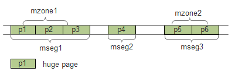

Memory
======

DPDK使用hugetlbfs内核文件系统支持大页的分配。连续的内存段抽象为\
rte_memseg，如果把rte_memseg中的一部分命名并以供使用，那么称为\
rte_memzone。三者的关系如下图所示。

本章只对DPDK内存机制做一个概述，并介绍EAL初始化时内存的初始化过程，\
各种内存机制的详细介绍见其他章节，如下表所示：

======== ===============
内存机制 章节
======== ===============
memseg   :doc:`memseg`
memzone  :doc:`memzone`
malloc   :doc:`malloc`
mempool  :doc:`mempool`
mbuf     :doc:`mbuf`
======== ===============

内存的初始化
------------

大页信息初始化
..............

eal_hugepage_info_init(librte_eal/linuxapp/eal/eal_hugepage_info.c):

大页信息结构为：

.. code-block:: c

     struct hugepage_info {
          uint64_t hugepage_sz;   /**< size of a huge page */
          const char *hugedir;    /**< dir where hugetlbfs is mounted */
          uint32_t num_pages[RTE_MAX_NUMA_NODES];
          /**< number of hugepages of that size on each socket */
          int lock_descriptor;    /**< file descriptor for hugepage dir */
      };

#. 读取 ``/sys/kernel/mm/hugepages`` 中的“hugepages-XXX”目录，最多读取
   3个。比如读取到 ``hugepages-2048kB`` ，将其中的 ``2048kB`` 转换为\
   2048*1024，存入internal_config.hugepage_info[num_sizes].hugepage_sz，
   num_sizes<3

#. 打开 ``/proc/meminfo`` 文件，读取 ``Hugepagesize`` 项的值，做为大页\
   默认大小。打开 ``/proc/mounts`` 文件，找到类似 
   ``hugetlbfs /dev/hugepages hugetlbfs rw,seclabel,relatime 0 0`` 或
   ``nodev /mnt/huge hugetlbfs rw,relatime 0 0`` 的行，根据选项\
   (rw,relatime)中出现的 ``pagesize=`` 项的值(如果有的话)，来返回\
   对应的大页文件系统挂载路径，如 ``/dev/hugepages`` 或 ``/mnt/huge`` ，\
   将其存入internal_config.hugepage_info[num_sizes].hugedir

#. 锁定hugedir(flock)
   
#. 打开 ``sys/kernel/mm/hugepages/hugepages-XXX`` 目录下面的
   ``resv_hugepages`` 和 ``free_hugepages`` 文件，计算可用大页数量，
   存入internal_config.hugepange_info->num_pages[0]，这个0是socket
   id，在支持NUMA的系统中先在socket 0上进行操作

#. internal_config.num_hugepage_sizes数设置为num_sizes数，不大于3

#. 将上述过程发现的所有num_sizes个大页信息按从大到小排序，并检查\
   至少有一个可用大页尺寸

大页内存初始化
..............

rte_eal_memory_init (librte_eal/common/eal_common_memory.c)

.. code-block:: c
    
    const int retval = rte_eal_process_type() == RTE_PROC_PRIMARY ?
                rte_eal_hugepage_init() :
                rte_eal_hugepage_attach();

这里对根据是主进程还是子进程，分别进行了处理。后续讲到多进程模式\
时还要说到这个问题。

rte_eal_hugepage_init(librte_eal/linuxapp/eal/eal_memory.c)

#. 检查 ``/proc/self/pagemap`` 是否可读

#. 计算各种页尺寸总共需要的页总数，并分配一个页表，每一页占一项

   .. code-block:: c

        for (i = 0; i < (int) internal_config.num_hugepage_sizes; i++) {
            used_hp[i].hugepage_sz = internal_config.hugepage_info[i].hugepage_sz;
            nr_hugepages += internal_config.hugepage_info[i].num_pages[0];
        }
        tmp_hp = malloc(nr_hugepages * sizeof(struct hugepage_file));

#. 映射所有大页

   .. code-block:: c

        map_all_hugepages(&tmp_hp[hp_offset], hpi, 1);

   在hugetlbfs挂载的路径，如 ``/mnt/huge`` 下面创建num_pages个文件，\
   文件名默认为 ``rtemap_XXX`` ，XXX是数字。之后以页大小将这些文件映射：

   .. code-block:: c

       fd = open(hugepg_tbl[i].filepath, O_CREAT | O_RDWR, 0755);
       virtaddr = mmap(vma_addr, hugepage_sz, PROT_READ | PROT_WRITE,
                            MAP_SHARED, fd, 0);

   如果orig为真，则将映射后的虚拟地址virtaddr赋给页表项结构的orig_va。\
   之后给文件加一把共享锁(LOCK_SH)。

#. 对所有页尺寸，取得上一步映射得到的虚拟地址的物理地址

   .. code-block:: c

       find_physaddrs(&tmp_hp[hp_offset], hpi);

   在此函数中，调用rte_mem_virt2phy(librte_eal/linuxapp/eal/eal_memory.c)\
   将虚拟地址转为物理地址:

   .. code-block:: c

        for (i = 0; i < hpi->num_pages[0]; i++) {
            addr = rte_mem_virt2phy(hugepg_tbl[i].orig_va);
            hugepg_tbl[i].physaddr = addr;
        }
    
   rte_mem_virt2phy：

   .. code-block:: c

        // Cannot parse /proc/self/pagemap, no need to log errors everywhere
        if (!proc_pagemap_readable)
            return RTE_BAD_PHYS_ADDR;

        // standard page size
        page_size = getpagesize();

        fd = open("/proc/self/pagemap", O_RDONLY);
        virt_pfn = (unsigned long)virtaddr / page_size;
        offset = sizeof(uint64_t) * virt_pfn;
        lseek(fd, offset, SEEK_SET); 
        read(fd, &page, sizeof(uint64_t));
        
        // the pfn (page frame number) are bits 0-54 (see
        // pagemap.txt in linux Documentation)
        physaddr = ((page & 0x7fffffffffffffULL) * page_size)
                + ((unsigned long)virtaddr % page_size);
        close(fd);
        return physaddr;

   其中，通过 ``/proc/self/pagemap`` 来从虚拟地址得到物理地址的\
   可以参考 [linux_pagemap]_ 和 [virt2phy]_ 。

#. 获取每一个大页对应的NUMA socket Id

   .. code-block:: c

        find_numasocket(&tmp_hp[hp_offset], hpi);

   打开 ``/proc/self/numa_maps`` 文件，解析其中的文本行，遇到\
   类似 ``7fd94fc00000 prefer:0 file=/dev/hugepages/rtemap_119 huge dirty=1 N0=1``
   的行，其中的7fd94fc00000是页的虚拟地址，N0=后面的数字0是该页\
   对应的socket Id。

#. 根据物理地址排序页表项

   .. code-block:: c

       sort_by_physaddr(&tmp_hp[hp_offset], hpi);

   在x86上，低地址在前，高地址在后。

#. 把排序后的页重新map一次 (此时orig参数为0)

   试图把连续的物理地址块映射到连续的虚拟地址块上。首先求物理地址\
   连续的页的个数，算出需要的虚拟地址区域长度，然后再试图取得相应\
   大小的虚拟地址，如果无法获取，则在mmap时让系统去决定虚拟地址：

   .. code-block:: c

       else if (vma_len == 0) {
           unsigned j, num_pages;
           for (j = i+1; j < hpi->num_pages[0] ; j++) {
               if (hugepg_tbl[j].physaddr != hugepg_tbl[j-1].physaddr + hugepage_sz) 
                   break;
           }
           num_pages = j - i;
           vma_len = num_pages * hugepage_sz;

           vma_addr = get_virtual_area(&vma_len, hpi->hugepage_sz);
           if (vma_addr == NULL)
               vma_len = hugepage_sz;
        }

#. 重新创建/打开大页文件并映射，把最终的虚拟地址存入final_va成员：

   .. code-block:: c

       fd = open(hugepg_tbl[i].filepath, O_CREAT | O_RDWR, 0755);
       virtaddr = mmap(vma_addr, hugepage_sz, PROT_READ | PROT_WRITE,
                MAP_SHARED, fd, 0);
       hugepg_tbl[i].final_va = virtaddr;

#. unmap第一次内存映射

#. 将页表项保存到共享内存

   .. code-block:: c

       hugepage = create_shared_memory(eal_hugepage_info_path(),
                nr_hugefiles * sizeof(struct hugepage_file));
       copy_hugepages_to_shared_mem(hugepage, nr_hugefiles,
                   tmp_hp, nr_hugefiles);

#. 将大页信息存入memory config结构rte_mem_config

   若干个页根据是否连续，是否同一个socket，是否相同页尺寸等，\
   分成最多RTE_MAX_MEMSEG(默认256)个内存段(memory segment)：

   .. code-block:: c

       if (new_memseg) {
           j += 1;
           if (j == RTE_MAX_MEMSEG)
               break;

                mcfg->memseg[j].phys_addr = hugepage[i].physaddr;
                mcfg->memseg[j].addr = hugepage[i].final_va;
                mcfg->memseg[j].len = hugepage[i].size;
                mcfg->memseg[j].socket_id = hugepage[i].socket_id;
                mcfg->memseg[j].hugepage_sz = hugepage[i].size;
       }
       // continuation of previous memseg
       else
           mcfg->memseg[j].len += mcfg->memseg[j].hugepage_sz;
           
       hugepage[i].memseg_id = j;

memzone初始化
.............

在EAL初始化过程中，先调用rte_eal_memory_init()进行了大页内存初始化，\
紧接着调用rte_eal_memzone_init()进行了memzone的初始化。

见 :ref:`memzone_init` 

参考
----

.. [linux_hugetlb] `Linux大页使用与实现简介 \
    <http://www.ibm.com/developerworks/cn/linux/l-cn-hugetlb/>`_
.. [linux_pagemap] `Kernel pagemap \
    <https://www.kernel.org/doc/Documentation/vm/pagemap.txt>`_
.. [virt2phy] `Translating Virtual Addresses to Physical Addresses in User Space \
    <https://shanetully.com/2014/12/translating-virtual-addresses-to-physcial-addresses-in-user-space/>`_

