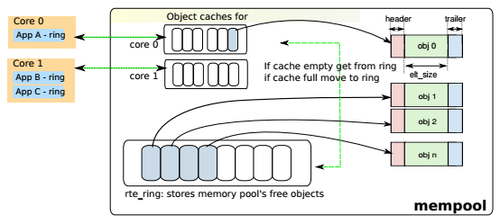

Mempool
=======

概述
----

DPDK mempool(以下简称mempool)是储存固定大小对象的内存池。每个mempool\
都有一个名字，它使用DPDK ring来存储对象，并为每一个lcore提供cache\
以提升性能。mempool还提供内存填充/对齐机制，以确保将对象公平地布置\
在DRAM或DDR3 channel上。

在数据面需要内存时应使用mempool来分配，例如报文的存储，而不应使用\
malloc。

特性
----

内存对齐
........

//TODO 此内容和内存channel和rank有关，见 \
`Memory Alignment Constraints <http://dpdk.org/doc/guides/prog_guide/mempool_lib.html#memory-alignment-constraints>`_

Cache机制
.........

mempool的对象存放在rte_ring中，当mempool所在NUMA节点(socket)上的\
多个lcore都需要通过这个ring来访问内存对象时，CAS(compare-and-set)\
操作会影响效率。为了解决这个问题，mempool为每个lcore维护了一个本地\
缓存(local cache)。lcore需要取出对象时，优先在这个cache取，如果\
不够，再从ring上拿。

数据结构
--------

rte_mempool(librte_mempool/rte_mempool.h)

.. code-block:: c

    struct rte_mempool {
        char name[RTE_MEMPOOL_NAMESIZE]; /**< Name of mempool. */
        struct rte_ring *ring;           /**< Ring to store objects. */
        phys_addr_t phys_addr;           /**< Phys. addr. of mempool struct. */
        int flags;                       /**< Flags of the mempool. */
        uint32_t size;                   /**< Size of the mempool. */
        uint32_t cache_size;             /**< Size of per-lcore local cache. */
        uint32_t cache_flushthresh;
        /**< Threshold before we flush excess elements. */

        uint32_t elt_size;               /**< Size of an element. */
        uint32_t header_size;            /**< Size of header (before elt). */
        uint32_t trailer_size;           /**< Size of trailer (after elt). */

        unsigned private_data_size;      /**< Size of private data. */

    #if RTE_MEMPOOL_CACHE_MAX_SIZE > 0
        // Per-lcore local cache
        struct rte_mempool_cache local_cache[RTE_MAX_LCORE];
    #endif

    #ifdef RTE_LIBRTE_MEMPOOL_DEBUG
        // Per-lcore statistics. */
        struct rte_mempool_debug_stats stats[RTE_MAX_LCORE];
    #endif

        /* Address translation support, starts from next cache line. */

        // Number of elements in the elt_pa array
        uint32_t    pg_num __rte_cache_aligned;
        uint32_t    pg_shift;     /**< LOG2 of the physical pages. */
        uintptr_t   pg_mask;      /**< physical page mask value. */
        uintptr_t   elt_va_start;
        /**< Virtual address of the first mempool object. */
        uintptr_t   elt_va_end;
        /**< Virtual address of the <size + 1> mempool object. */
        phys_addr_t elt_pa[MEMPOOL_PG_NUM_DEFAULT];
        /**< Array of physical page addresses for the mempool objects buffer. */

    }  __rte_cache_aligned;

mempool中存储的每一个对象的结构分3部分，首部，数据和尾部。每一部分\
都填充以做到字节对齐，在调试模式首部和尾部还可以加上cookie。

rte_mempool_cache(librte_mempool/rte_mempool.h)

.. code-block:: c

    struct rte_mempool_cache {
        unsigned len; /**< Cache len */
        void *objs[RTE_MEMPOOL_CACHE_MAX_SIZE * 3]; /**< Cache objects */
    } __rte_cache_aligned;

创建
----

rte_mempool_xmem_create (librte_mempool/rte_mempool.c)

#. 计算mempool中每一个对象的大小
#. 计算mempool总大小
#. 调用rte_memzone_reserve分配所需内存空间
   memzone相关原理见 :doc:`memzone` ，它将同时返回虚拟地址和物理地址
#. 计算对象分配的起始地址，包括虚拟地址和起始地址
#. 调用mempool初始化回调函数，并对每一个对象调用对象初始化回调函数

取出对象
--------

核心函数是__mempool_get_bulk(librte_mempool/rte_mempool.h)，这里\
令n=对象个数，cache_size为cache配置大小，cache_len为cache当前大小，
那么步骤为

1. 如果配置的cache_size=0、是单消费者(sc)或者n>=cache_len，则跳到4
2. 如果cache_len<n，则从ring申请足够对象放到cache上，否则到3
3. 从cache上取出对象，结束
4. 在ring上进行出队操作，取出对象

还回对象
--------

核心函数是__mempool_put_bulk(librte_mempool/rte_mempool.h)，步骤为

1. 如果cache_size=0、是单生产者(sp)或者n大于cache最大限制值，则跳到3
2. 将对象添加到cache，然后如果cache_len>=阈值，则将(cache_len-cache_size)\
   个对象还回ring，结束
3. 在ring上进行入队操作，还回对象

参考
----

.. [dpdk_guide_mpool] `DPDK programmer's guide - Mempool \
    <http://dpdk.org/doc/guides/prog_guide/mempool_lib.html>`_

