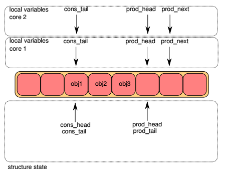
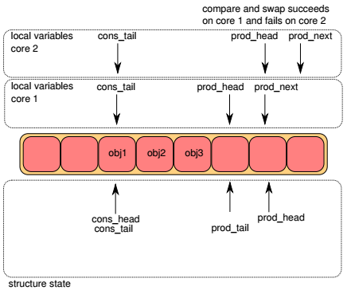
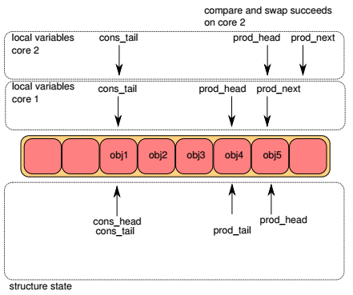
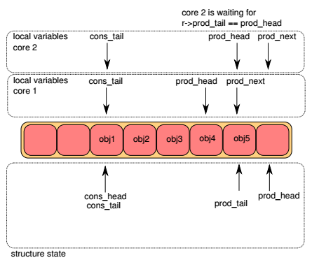
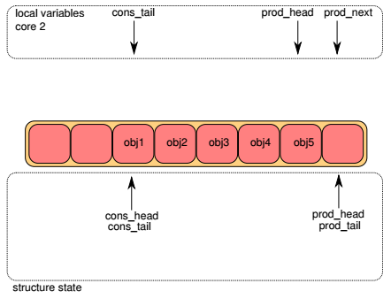

Ring
====

概述
----

rte_ring(以下简称ring)是一个高效率的无锁环形队列，它具有以下特点：

* FIFO
* 队列长度是固定的，所有指针存放在数组中
* 无锁实现(lockless)
* 多消费者或单消费者出队
* 多生产者或单消费者入队
* 批量(bulk)出队 - 出队N个对象，否则失败
* 批量(bulk)入队 - 入队N个对象，否则失败
* 突发(burst)出队 - 尽可能地出队N个对象
* 突发(burst)入队 - 尽可能地入队N个对象

与链表实现的队列相比，ring有以下优点：

* 更快 - 仅需要一次CAS(Compare-And-Swap)操作
* 比完全无锁的队列实现更简单
* 适配批量操作 - 由于指针存放在数组中，相比链表式队列多个对象的\
  操作没有太大的cache miss

当然，ring也有缺点：

* 队列长度固定
* 比链表式队列更消耗内存(因为创建的时候队列长度便固定了)

ring的实现借鉴了 [freebsd_ring]_ 和 [linux_ringbuffer]_ 。 

应用场景
--------

* DPDK应用程序之间的通信
* DPDK mempool

无锁队列操作图解
----------------

下面将以多生产者(multi-producer, mp)的情形来说明ring入队时的操作，\
多消费者出队的基本原理可以此类比。

每个ring都有两对head，tail指针，一对用于生产者(入队)，另一对用于\
消费者(出队)。在下面各图中，上半部分表示lcore入队函数的局部变量，
下半部分表示ring的成员变量。objX表示队列中的对象。

Step1
.....

一开始，lcore1和lcore2局部变量pro_head和cons_tail都和queue成员一致，\
局部变量prod_next都指向队列插入位置，即prod_head的前面。

Step2
.....

接下来两个lcore通过CAS指令进行竞争，更新ring->prod_head改为胜者lcore的prod_next：

* 如果ring->prod_head != prod_head, CAS失败，返回Step1
* 否则，CAS成功，ring->prod_head = prod_next

下图中，lcore1竞争获胜，而lcore2需要重新进行Step1：

Step3
.....

lcore2上的CAS操作也成功。lcore1将obj4入队，lcore2将obj5入队。

Step4
.....

两个lcore进行竞争，更新ring->prod_tail：

* 如果ring->prod_tail != prod_head，CAS失败，继续尝试
* 否则，CAS成功, ring->prod_tail = prod_next

下图中，lcore1竞争获胜，lcore1上的入队操作到此结束。

Step5
.....

lcore2如Step4一样，更新ring->prod_tail。至此lcore2的入队操作也已完成。

数据结构
--------

.. code-block:: c
    
    struct rte_ring {
        char name[RTE_RING_NAMESIZE];    /**< Name of the ring. */
        int flags;                       /**< Flags supplied at creation. */
        const struct rte_memzone *memzone;
                /**< Memzone, if any, containing the rte_ring */

        struct prod {
            uint32_t watermark;      /**< Maximum items before EDQUOT. */
            uint32_t sp_enqueue;     /**< True, if single producer. */
            uint32_t size;           /**< Size of ring. */
            uint32_t mask;           /**< Mask (size-1) of ring. */
            volatile uint32_t head;  /**< Producer head. */
            volatile uint32_t tail;  /**< Producer tail. */
        } prod __rte_cache_aligned;

        struct cons {
            uint32_t sc_dequeue;     /**< True, if single consumer. */
            uint32_t size;           /**< Size of the ring. */
            uint32_t mask;           /**< Mask (size-1) of ring. */
            volatile uint32_t head;  /**< Consumer head. */
            volatile uint32_t tail;  /**< Consumer tail. */
    #ifdef RTE_RING_SPLIT_PROD_CONS
        } cons __rte_cache_aligned;
    #else
        } cons;
    #endif

    #ifdef RTE_LIBRTE_RING_DEBUG
        struct rte_ring_debug_stats stats[RTE_MAX_LCORE];
    #endif

        void * ring[0] __rte_cache_aligned; /**< Memory space of ring starts here.
                                             * not volatile so need to be careful
                                             * about compiler re-ordering */
    };

多生产者入队
------------

第34-36行处理多个producer的竞争，没有竞争到写入位置的线程将继续循环。\
第39行插入了一个rte_smp_wmb()调用，对这个函数DPDK文档的解释是：

    Write memory barrier between lcores. Guarantees that the STORE
    operations that precede the rte_smp_wmb() call are globally
    visible across the lcores before the the STORE operations that follows it.

第49行的循环用于无锁同步对prod.tail的修改。

.. code-block:: c
    :linenos:
    :emphasize-lines: 34,35,36,39,49,50,55

    static inline int __attribute__((always_inline))
    __rte_ring_mp_do_enqueue(struct rte_ring *r, void * const *obj_table,
                 unsigned n, enum rte_ring_queue_behavior behavior)
    {
        uint32_t prod_head, prod_next;
        uint32_t cons_tail, free_entries;
        const unsigned max = n;
        int success;
        unsigned i, rep = 0;
        uint32_t mask = r->prod.mask;
        int ret;

        do {
            n = max;

            prod_head = r->prod.head;
            cons_tail = r->cons.tail;
            free_entries = (mask + cons_tail - prod_head);

            if (unlikely(n > free_entries)) {
                if (behavior == RTE_RING_QUEUE_FIXED) {
                    return -ENOBUFS;
                }
                else {
                    if (unlikely(free_entries == 0)) {
                        return 0;
                    }

                    n = free_entries;
                }
            }

            prod_next = prod_head + n;
            success = rte_atomic32_cmpset(&r->prod.head, prod_head,
                              prod_next);
        } while (unlikely(success == 0));

        ENQUEUE_PTRS();
        rte_smp_wmb();

        if (unlikely(((mask + 1) - free_entries + n) > r->prod.watermark)) {
            ret = (behavior == RTE_RING_QUEUE_FIXED) ? -EDQUOT :
                    (int)(n | RTE_RING_QUOT_EXCEED);
        }
        else {
            ret = (behavior == RTE_RING_QUEUE_FIXED) ? 0 : n;
        }

        while (unlikely(r->prod.tail != prod_head)) {
            rte_pause();

            if (RTE_RING_PAUSE_REP_COUNT &&
                ++rep == RTE_RING_PAUSE_REP_COUNT) {
                rep = 0;
                sched_yield();
            }
        }
        r->prod.tail = prod_next;
        return ret;
    }

ENQUEUE_PTRS:

第5行，如果n>4，则把它分成数次写入，每次写入4个指针；不足4的余数\
在switch语句中写入。

.. code-block:: c
    :linenos:
    :emphasize-lines: 5

    #define ENQUEUE_PTRS() do { \
        const uint32_t size = r->prod.size; \
        uint32_t idx = prod_head & mask; \
        if (likely(idx + n < size)) { \
            for (i = 0; i < (n & ((~(unsigned)0x3))); i+=4, idx+=4) { \
                r->ring[idx] = obj_table[i]; \
                r->ring[idx+1] = obj_table[i+1]; \
                r->ring[idx+2] = obj_table[i+2]; \
                r->ring[idx+3] = obj_table[i+3]; \
            } \
            switch (n & 0x3) { \
                case 3: r->ring[idx++] = obj_table[i++]; \
                case 2: r->ring[idx++] = obj_table[i++]; \
                case 1: r->ring[idx++] = obj_table[i++]; \
            } \
        } else { \
            for (i = 0; idx < size; i++, idx++)\
                r->ring[idx] = obj_table[i]; \
            for (idx = 0; i < n; i++, idx++) \
                r->ring[idx] = obj_table[i]; \
        } \
    } while(0)
    

多消费者出队
------------

.. code-block:: c
    :linenos:
    :emphasize-lines: 33,34,35,38,40,41,46

    static inline int __attribute__((always_inline))
    __rte_ring_mc_do_dequeue(struct rte_ring *r, void **obj_table,
             unsigned n, enum rte_ring_queue_behavior behavior)
    {
        uint32_t cons_head, prod_tail;
        uint32_t cons_next, entries;
        const unsigned max = n;
        int success;
        unsigned i, rep = 0;
        uint32_t mask = r->prod.mask;

        do {
            n = max;

            cons_head = r->cons.head;
            prod_tail = r->prod.tail;
            entries = (prod_tail - cons_head);

            if (n > entries) {
                if (behavior == RTE_RING_QUEUE_FIXED) {
                    return -ENOENT;
                }
                else {
                    if (unlikely(entries == 0)){
                        return 0;
                    }

                    n = entries;
                }
            }

            cons_next = cons_head + n;
            success = rte_atomic32_cmpset(&r->cons.head, cons_head,
                              cons_next);
        } while (unlikely(success == 0));

        DEQUEUE_PTRS();
        rte_smp_rmb();

        while (unlikely(r->cons.tail != cons_head)) {
            rte_pause();

            if (RTE_RING_PAUSE_REP_COUNT &&
                ++rep == RTE_RING_PAUSE_REP_COUNT) {
                rep = 0;
                sched_yield();
            }
        }
        r->cons.tail = cons_next;

        return behavior == RTE_RING_QUEUE_FIXED ? 0 : n;
    }

.. code-block:: c
    :linenos:
    :emphasize-lines: 5

 
    #define DEQUEUE_PTRS() do { \
        uint32_t idx = cons_head & mask; \
        const uint32_t size = r->cons.size; \
        if (likely(idx + n < size)) { \
            for (i = 0; i < (n & (~(unsigned)0x3)); i+=4, idx+=4) {\
                obj_table[i] = r->ring[idx]; \
                obj_table[i+1] = r->ring[idx+1]; \
                obj_table[i+2] = r->ring[idx+2]; \
                obj_table[i+3] = r->ring[idx+3]; \
            } \
            switch (n & 0x3) { \
                case 3: obj_table[i++] = r->ring[idx++]; \
                case 2: obj_table[i++] = r->ring[idx++]; \
                case 1: obj_table[i++] = r->ring[idx++]; \
            } \
        } else { \
            for (i = 0; idx < size; i++, idx++) \
                obj_table[i] = r->ring[idx]; \
            for (idx = 0; i < n; i++, idx++) \
                obj_table[i] = r->ring[idx]; \
        } \
    } while (0)

索引计算
--------

ring中的生产者和消费者指针(prod.head, prod.tail, cons.head, cons.tail)\
是用32位无符号整数来表示的，而ring存放对象指针的数组的大小是远小于\
UINT32_MAX的，计算存取对象的数组索引需要有一定技巧；另外，由于\
ring是一个环形buffer，这些指针值溢出后会发生回绕，计算ring中已用\
和空闲对象的数目也需要注意方法。

* **求索引** ENQUEUE_PTRS和DEQUEUE_PTRS中::

    uint32_t idx = prod_head & mask;
    其中，mask = size-1

* **求已有项数**

.. code-block:: c

    static inline unsigned
    rte_ring_count(const struct rte_ring *r)
    {
        uint32_t prod_tail = r->prod.tail;
        uint32_t cons_tail = r->cons.tail;
        return ((prod_tail - cons_tail) & r->prod.mask);
    }

或

.. code-block:: c

    entries = (prod_tail - cons_head);

* **求空闲项数**

.. code-block:: c

    static inline unsigned
    rte_ring_free_count(const struct rte_ring *r)
    {
        uint32_t prod_tail = r->prod.tail;
        uint32_t cons_tail = r->cons.tail;
        return ((cons_tail - prod_tail - 1) & r->prod.mask);
    }

或

.. code-block:: c

    free_entries = (mask + cons_tail - prod_head);

.. note::
    这些算法要求ring的大小必须是2的N次方

以下举例说明。令p为生产者指针值，c为消费者指针值，size=16为ring大小，\
取mask=(size-1)=15为掩码，idx_p和idx_c为p和c对应的ring索引，used为\
已用对象数，free为空闲对象数。

#. 初始化时，这4个指针值都为0
#. p=14, c=3时::

    idx_p = p & mask = 14
    idx_c = c & mask = 3
    used = p - c = 11
    free = (mask + c - p) = (15 + 3 - 14) = 4

#. p=20, c=9时::

    idx_p = p & mask = 4 
    idx_c = c & mask = 9
    used = p - c = 20 - 9 = 11
    free = (mask + c - p) = (15 + 9 - 20) = 4

.. note:: 注意最后一个free的求法

参考
----

.. [dpdk_guide_ring] `DPDK programmer's guide - Ring Library \
    <http://dpdk.org/doc/guides/prog_guide/ring_lib.html>`_

.. [freebsd_ring] `FreeBSD buf_ring <http://svn.freebsd.org/viewvc/base/release/8.0.0/sys/sys/buf_ring.h?revision=199625&amp;view=markup>`_

.. [linux_ringbuffer] `Linux Lockless Ring Buffer <http://lwn.net/Articles/340400/>`_ 。

.. [lockfree_queue] `Yet another implementation of a lock-free circular array queue \
    <http://www.codeproject.com/Articles/153898/Yet-another-implementation-of-a-lock-free-circular>`_

.. [lockfree_coolshell] `酷壳：无锁队列的实现 <http://coolshell.cn/articles/8239.html>`_

